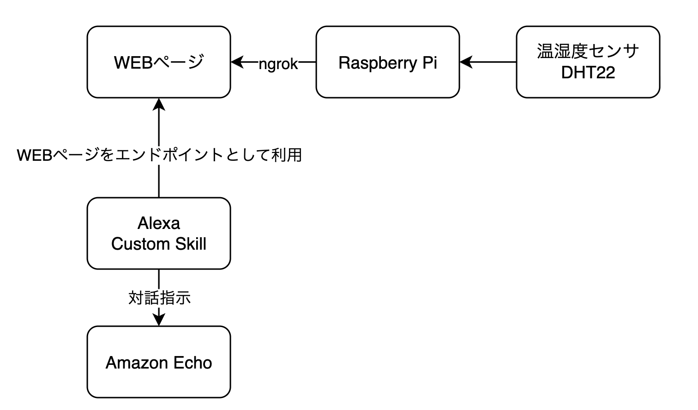
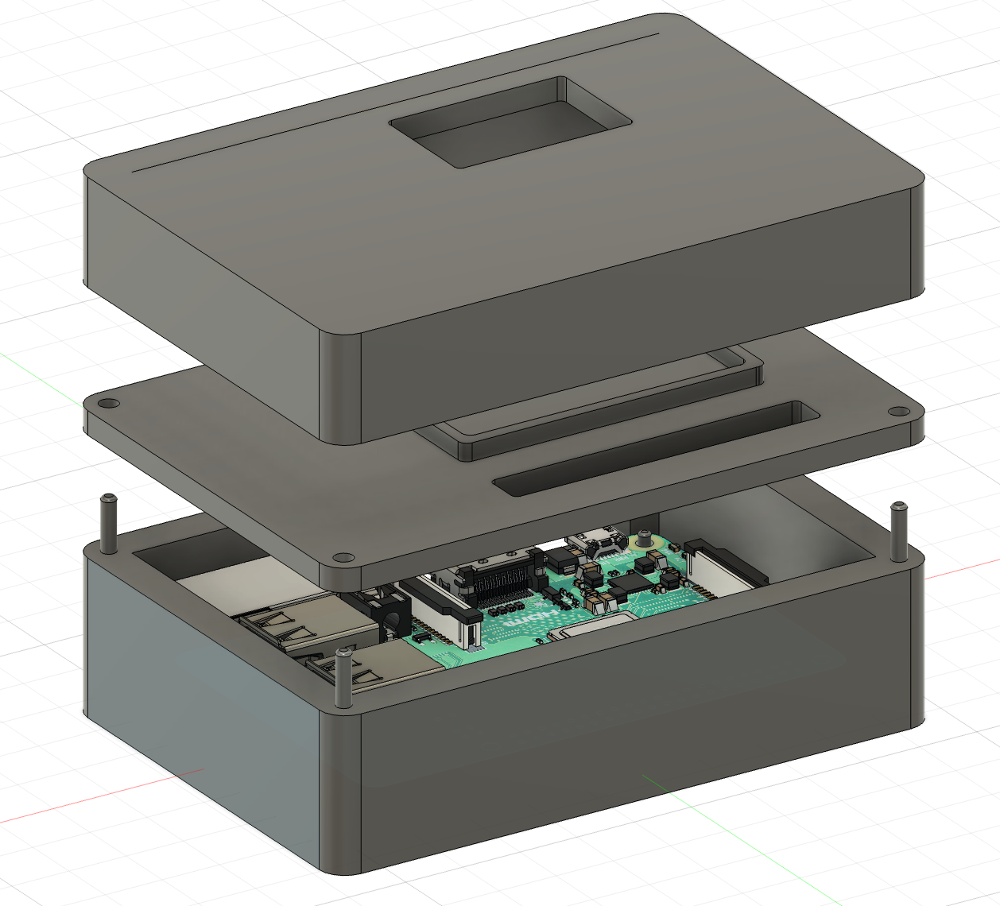
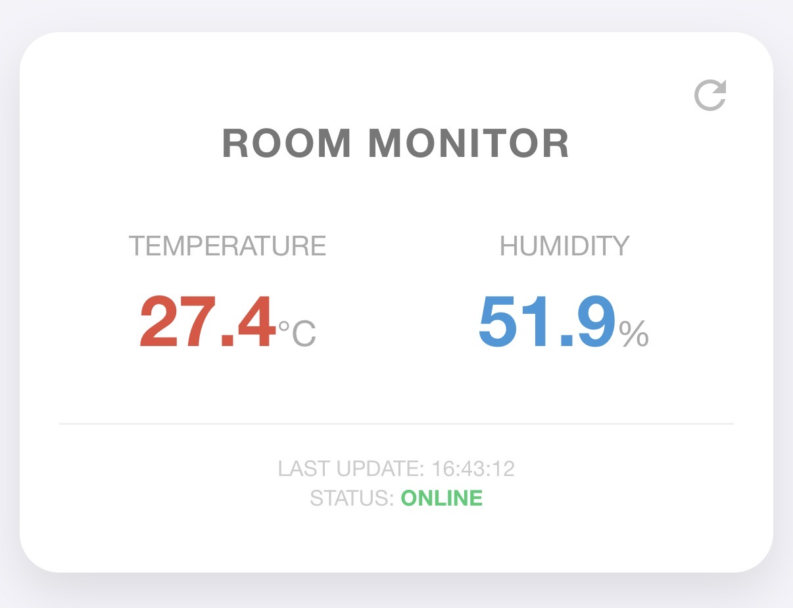

## Overview
Alexaに尋ねたり、特定のWEBサイトにアクセスしたりすることで部屋の温度や湿度を取得することのできるシステムを開発しました。特にAlexaには「Alexa、今の室温は？」などと尋ねることにより各種情報を教えてもらえます。話しかけるだけでシームレスに部屋の温度と湿度を知ることができます。

## Motivation
どの部屋にでも温度計や湿度計があることが大抵で、「そこまで歩き、時にしゃがみ、温湿度を読み取る」という流れが毎日のように行われています。日々の生活の中では難なくこなしていますが、一ヶ月や一年単位で見ると無駄な時間が大きくなってしまっているのではないかと感じました。特に面倒くさがりな人にとっては温湿度を見に行くのは面倒なこととして捉えられることが大半です。自身も例に漏れず、面倒だと感じたので、ただ話しかけたり、いつでも手元にあるスマートフォンを見たりするだけで、温湿度を確認できれば良いなと考え、本システムを開発しました。

## Development
簡単なシステム図を以下に示します。

<figure>
    
    <figcaption>システム図</figcaption>
</figure>

また、室内のインテリアに馴染ませることにも取り組みたかったため、Raspberry Piおよびセンサ類を隠すことができるようにケース類を設計・製作しました。

<figure>
    
    <figcaption>Autodesk Fusionでケースを設計する様子</figcaption>
</figure>

なお、開発リポジトリはセキュリティに関わる情報の切り離しが完了していないため、非公開としています。

## Skill Sets
使用した技術（スキル）は以下の通りです。
- Raspberry Pi
- Python
- 電子工作
- HTML / CSS / JavaScript
  - WEB部分は基本的に生成AIによる出力を使用しました
- Autodesk Fusion
- 3D Printer

## Outcome
最上部に示したようなRaspberry Piおよび温湿度センサを組み込んだ機体を作成することができました。

WEBページにアクセスすると、以下のように温湿度を確認することができます。

<figure>
    
    <figcaption>携帯電話から部屋の温湿度を確認する様子</figcaption>
</figure>

また、Alexaに『現在の部屋の温度と湿度を教えて』といった際の反応は以下をご覧ください。


