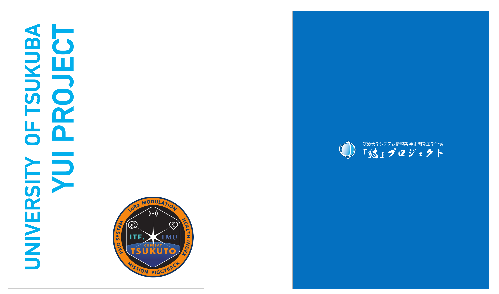
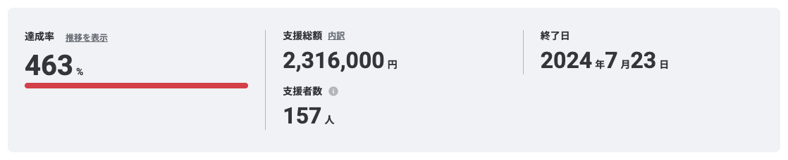

## Overview
筑波大学「結」プロジェクトの代表として、超小型人工衛星TSUKUTOの開発費調達のためのクラウドファンディングを実施しました。プロジェクトのオリジナルグッズなどをリターン品として設計することで、2,316,000円の調達に成功しました。クラウドファンディングで調達した資金は打上げ費用や物品購入費用として使用しました。

## Motivation
自身が筑波大学に入学し、筑波大学「結」プロジェクトに加入した際にはすでにクラウドファンディング実施の構想が完了しており、準備が始まっていました。また、紹介ページのドラフトの作成も完了していましたが、あまりデザインに工夫がされていない上に、一般の方が読んでも一切理解できないような難解な内容になってしまっていました。そこで自身が紹介ページの変更案を提示していく中で、クラウドファンディング担当として抜擢されました。

大学入学時からものづくりを通じて技術力を高めるだけでなく、コミュニケーション能力やデザイン能力、渉外能力といった力を鍛えたいと思っていたので、自身の成長の場として最適と考え、多くの時間をクラウドファンディングの運営にかけました。人手不足から一人で運営する他なく、かなり大変でしたが、非常に楽しむことができました。

## Development
基本的にクラウドファンディングの運営に関わるあらゆる業務を自力で行いました。以下では行った取り組みの一部を紹介します。

#### 紹介ページの作成
クラウドファンディングのために使用したプラットフォームは紹介ページのカスタマイズ性が著しく悪く、プレーンテキストに太字・下線・ハイライトを施す程度の装飾を加えることしかできませんでした。それでは紹介ページが地味なものになってしまうと考えたため、画像データとしてすでに完成したデザインを挿入することで対処しました。限られた機能の中で、可能な限り読みやすく、そして目に留まるデザインとなるように工夫を加えました。

デザインは基本的にMicrosoft PowerPointを用いて作成し、可読性の高いものになるように工夫しました。また、画像の埋め込みにすることによって、SEOの性能が悪化しないように、画像の埋め込みの量を減らしたり、適切なaltメッセージを付したりすることで対処しました。

紹介ページは以下のリンクより、ご覧いただけます。



#### リターンの設計
より多くの人にご興味を持っていただき、リターンをきっかけとした寄付を増やすために、魅力的なリターンを設定できるように工夫しました。一般の方にとってはあまり馴染みのない宇宙や人工衛星を、より身近に親しみやすいものと感じてもらえるようなリターンになるようにさまざまな工夫を行いました。

また、リターン物品のデザインは基本自身で行い、使い慣れないAdobe Illustratorを活用することでクリアファイルやキーホルダーのデザインを作成しました。

<figure>
    
    <figcaption>デザインしたクリアファイル</figcaption>
</figure>

## Outcome
クラウドファンディングは50万円のゴールを達成し、最終的には230万円超のご寄付をいただくことに成功しました。クラウドファンディングでの成功は決して私一人によるものではありませんが、わずか1ヶ月の間で230万円超というご寄付をいただけたことは非常に嬉しかったです。この成功によって、プロジェクトが大きく一歩前進しただけでなく、自身の広報・渉外への興味がより一層強まりました。

<figure>
    
    <figcaption>成功したクラウドファンディング</figcaption>
</figure>