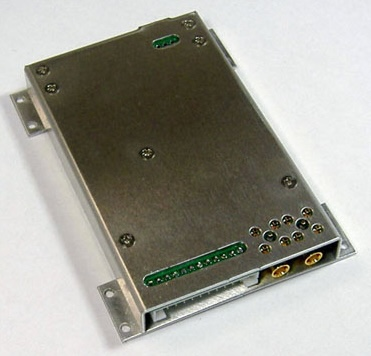
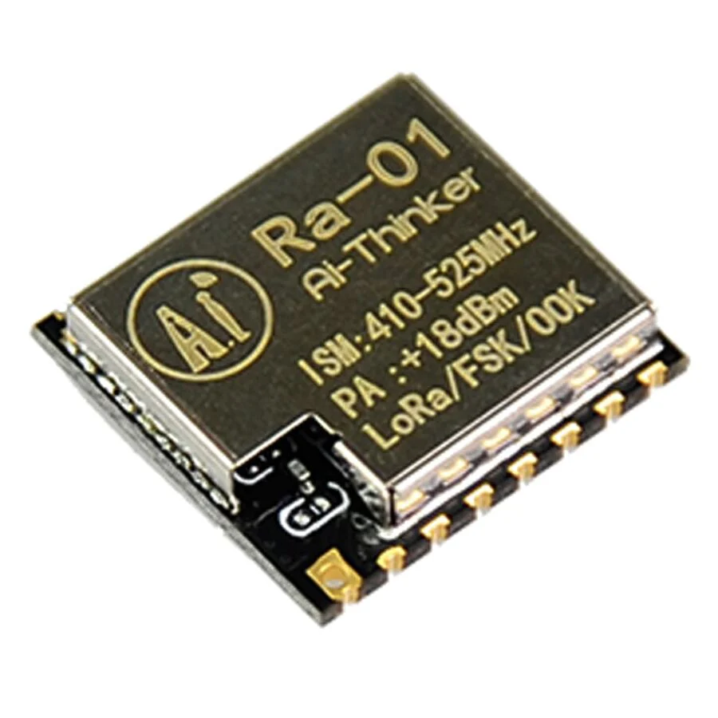
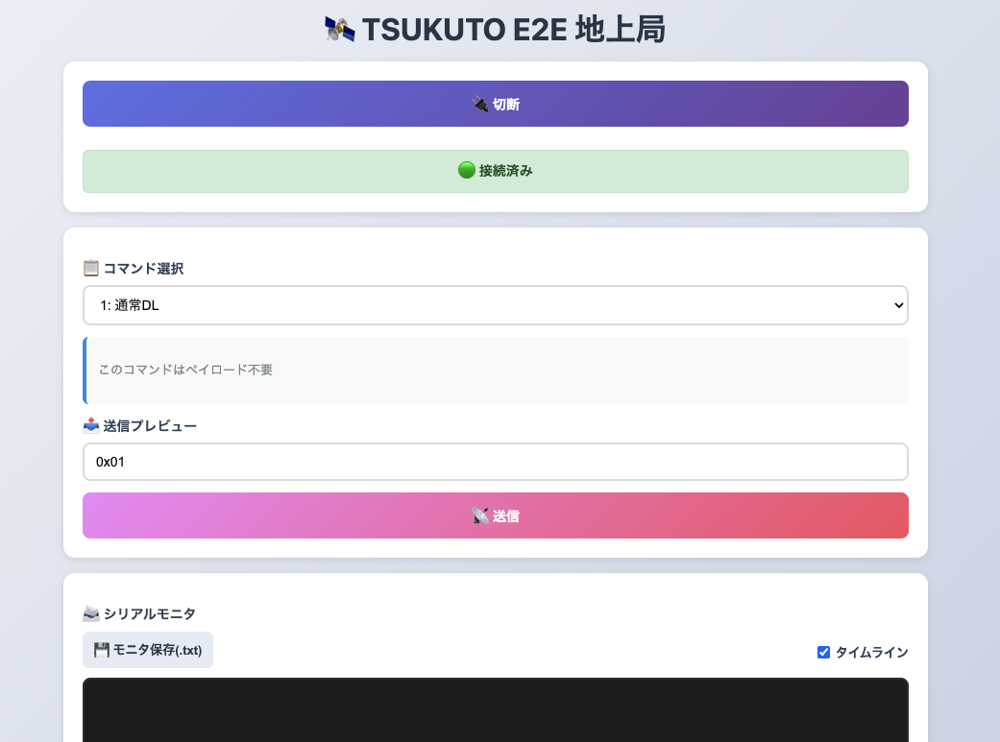

## Overview
「通信」はCubeSat（人工衛星）にとって、最も欠かせない要素といえます。というのも、CubeSatが宇宙に打ち上がった後は目視で状態を確認することはできないので、CubeSatの状態や宇宙環境の情報を知るためには人工衛星と通信をする必要があります。そのため、CubeSatを開発する上で盤石な通信システムを作ることは必要不可欠です。

筑波大学「結」プロジェクトが2027年頃に打上げ予定のTSUKUTOの通信システムの担当として、衛星局のソフトウェア開発および地上局のハードウェア整備に従事しました。また、2025年度までは通信系（チーム）のサブチーフにもアサインされており、主に新入生の教育へ力を入れ、今や新入生が開発の主体へと成長してくれました。

## Motivation
自身は大学に入るまで、特に「宇宙」へ興味を持つことがなく過ごしていましたが、大学入学後のオリエンテーションで初めて筑波大学にCubeSat開発をしている団体があると知りました。「大学では大きなチームでものづくりを体感してみたい」と感じていた自分にとってはぴったりだと思い、筑波大学「結」プロジェクトへの加入を決めました。

自身は学類（学科）で宇宙工学を専攻していたわけではなかったため、ゼロから知識を身につけていく必要がありました。また、当時はプログラミングやはんだづけといった、ものづくりに不可欠な経験もほとんどありませんでした。しかし、CubeSat開発の楽しさに気付いてからは、先輩方や世界の第一線で活躍する宇宙開発エンジニアに少しでも近づきたいという思いで、主体的に学習を重ねました。

また、CubeSat開発の中で「通信」の分野にチャレンジするきっかけは、正直に言うとプロジェクト内で一番人材が足りていなかったというだけでしたが、日々の開発の中で「通信」のロマンを発見し、今や通信の虜となっています。通信系所属後は自身のアマチュア無線局も開局したり、さまざまな通信設備の見学を行ったりと精力的に通信についてより多くのことを知ろうと活動しています。

## Development
自身が行ったCubeSatの「通信」に関する開発の一部を紹介します。

#### メイン通信機のソフトウェア開発
宇宙開発においては、搭載するコンポーネントに宇宙で動いたという宇宙実績があることが重要視されます。特に「通信」は衛星の運用には最も必要不可欠なものなので、特に宇宙実績のある通信機を搭載することが要求されます。そこで、筑波大学「結」プロジェクトでは多くの人工衛星に搭載されてきた無線機を購入し、搭載するという方針を取りました。しかし、その無線機にはサンプルプログラムやライブラリが全く存在せず、動作させることが非常に難しいという現状でした。宇宙開発をしている団体の多くはセキュリティや知財の観点からソフトウェアを非公開としており、その影響を受けた形となります。

そこで私はより多くの人に宇宙開発をしてもらいたいという思いからその無線機のライブラリ開発に着手しました。汎用性と信頼性の両方が高いプログラムになるように設計と試験を繰り返しました。その結果、無事無線機を動作させることができ、地上での通信試験を完了させました。なお、現在はライブラリの公開準備中です。

<figure>
    
    <figcaption>搭載する無線機（西無線研究所HPより引用）</figcaption>
</figure>

#### ミッション通信機のソフトウェア開発
TSUKUTOではミッションとして低消費電力でありながら、長距離通信が可能なLoRaを用いた無線機を搭載することとしました。430MHz帯（アマチュア無線帯）でLoRa通信を宇宙で実証した団体はいまだに存在せず（2026年6月現在）、我々が宇宙で実証することで世界中のCubeSatのさらなる省消費電力化を推進することができます。

そこでミッション通信機を宇宙機に搭載する無線機として十分に機能させるべく、ライブラリの整備を行いました。

<figure>
    
    <figcaption>ミッション通信機</figcaption>
</figure>

同時に、「どのようなケースでは通信に成功するのか」や「LoRa通信がそもそも宇宙機の無線機として適切か」などが既知ではなかったため、さまざまな条件やパラメータでの通信試験を行いました。通信試験ではソフトウェアやハードウェアのいわゆる電子工作の知識だけでは足らず、通信工学やアマチュア無線などの知識・経験も必要不可欠であったため、そういった部分の学習も同時に行いました。

#### 地上局の整備
人工衛星の運用では地上局（地球上に存在する無線局）も必要不可欠です。そこで地上局のソフトウェアや通信機の整備も同時進行で行っています。地上局のハードウェアに関しては、衛星局と同構成にすることでソフトウェアのメンテナンス性を向上させています。

<figure>
    
    <figcaption>作成した地上局の模擬ソフトウェア</figcaption>
</figure>

## Skill Sets
- Arduino
- Arduino IDE
  - C++
- 電子工作
- PM

## Outcome
2026年6月現在、TSUKUTOはまだ開発中です。

確実に運用成功できるように、日々努力を重ねてまいります。
