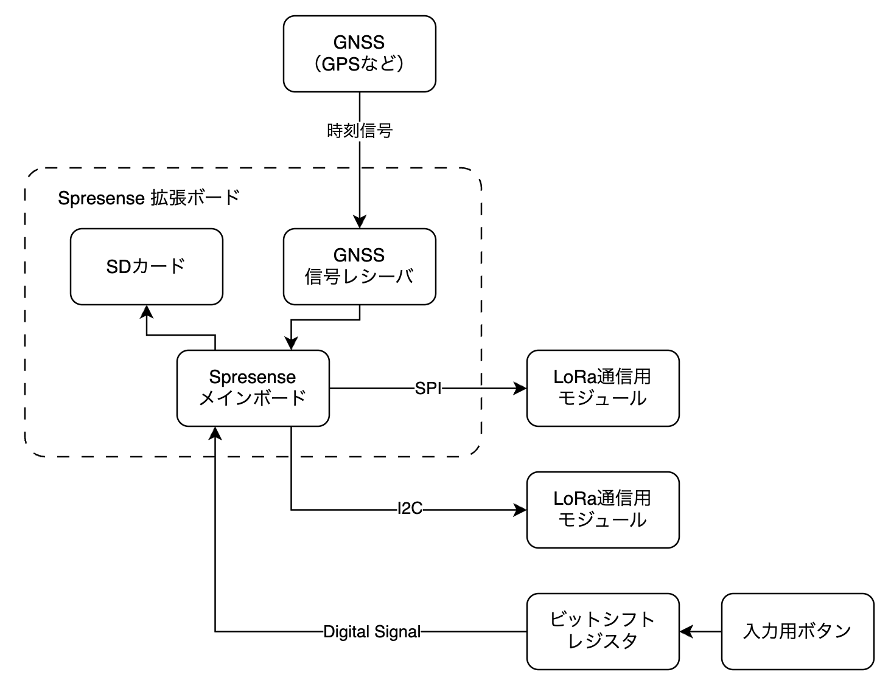
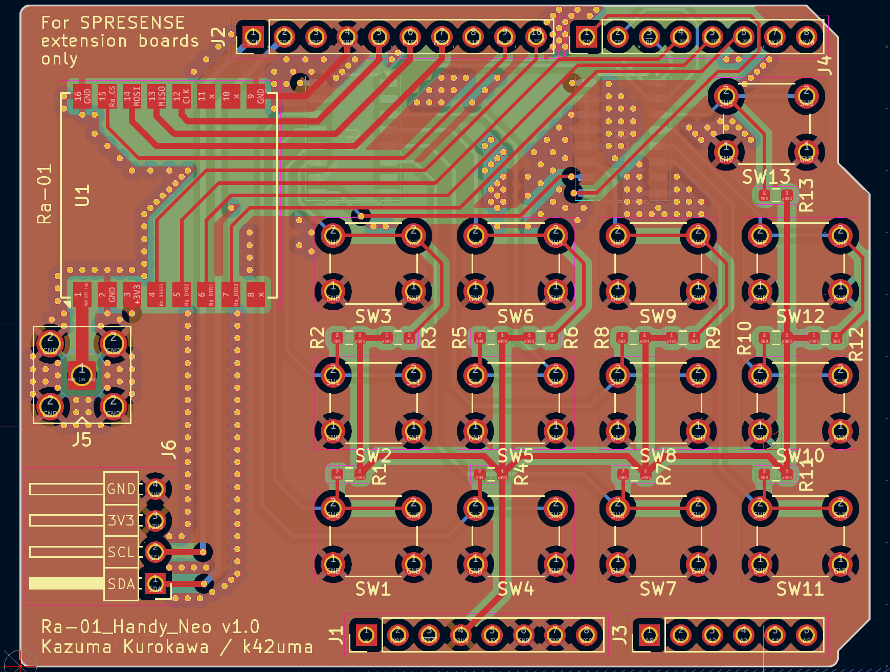
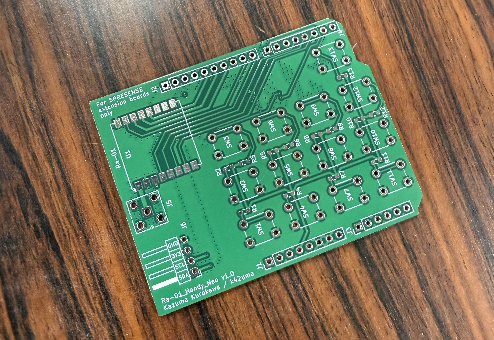
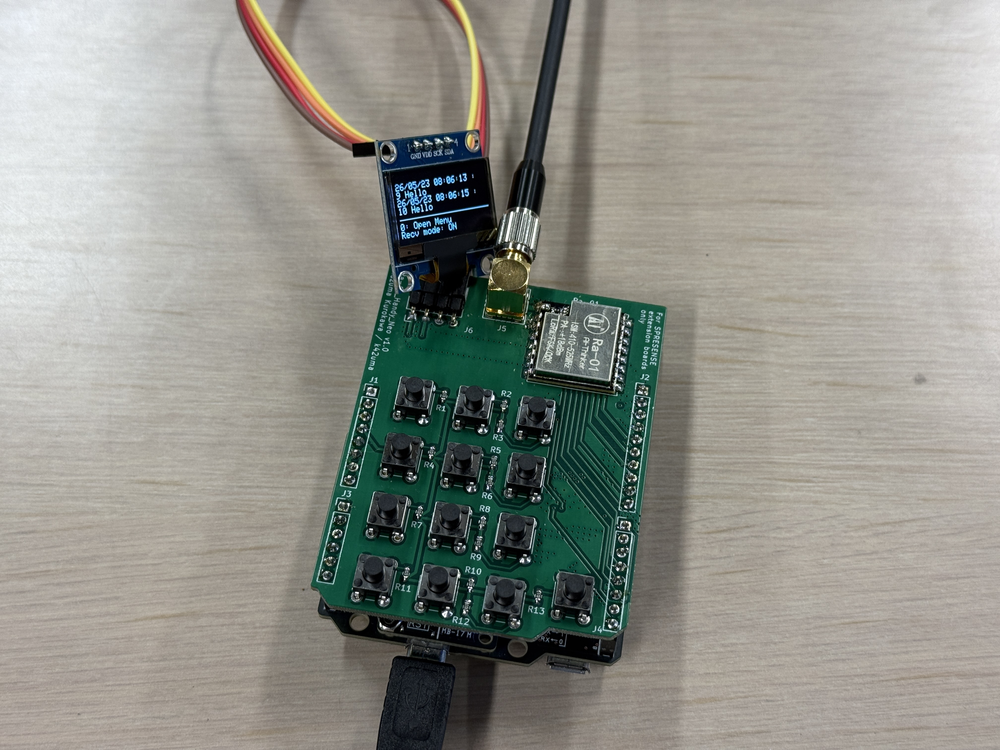

## Overview
LoRaとはLPWA（Low Power Wide Area）の一種で、小さい消費電力で長距離通信を可能にする通信方式です。自身が所属する超小型人工衛星開発団体である『筑波大学「結」プロジェクト』では衛星と地球間の通信手段として本通信方式を採用しています。自身が作成した『LoRaハンディ』とはLoRaでの送受信が可能な手持ちサイズの通信機のことで、LoRaを用いて文字列の送受信を行い、通信検証を行うことができます。

## Motivation
自身が所属する『筑波大学「結」プロジェクト』は小さい消費電力でありながら、長距離通信が可能であるという点に着目し、使用できる電力に強い制限のあるCubeSat（超小型人工衛星）においてLoRa通信を採用しました。私はCubeSatでのLoRa通信に関する開発や学習を通じて、LoRa通信へ強い興味を感じた上に、その中でLoRa通信の知名度がかなり低く、受信環境が整っている人がごくわずかしか存在しないことに気づきました。かつてより衛星通信の変調方式として利用されていた『GMSK』などは適切な受信環境をすでに揃えている人が多いですが、LoRa通信はそういった設備を持つ人がかなり少ないです。（その上、既存の設備では原理的に変復調することが困難なケースが多いです。）そこで、自身は人々（特にアマチュア無線家）がよりLoRa通信を身近に感じ、そして気軽に使えるような無線機を開発したいと考えるようになりました。

また、自身のものづくりの中でソフトウェア開発・回路設計・ハードウェア開発の3点を総合的に行ってみたいという気持ちもあり、自身一人でオリジナルのLoRaハンディを作成することに決めました。

## Development
LoRaハンディが持つ機能を以下に示します。
- （前提）スタンドアローンで使用可能
  - 電源供給のみで全ての機能を使用できること
  - パソコンの接続なしに使用できること
- キー入力
- LoRaでの送受信
- 送受信やパラメータ変更のログの保存
- GNSSを使用した時刻同期

上記の機能要求を満たせるように作成した、システムの設計概要図を以下に示します。

<figure>
    
    <figcaption>システム図</figcaption>
</figure>

ソフトウェアはArduino環境を採用し、各コンポーネントごとにクラスを設計し、それらをinoファイルで統合するような形で開発しました。また、回路はKiCadで設計を行い、JLCPCBで基板を発注しました。基板の設計時は高周波にノイズが載らないように細心の注意を払い、ビアの設置や配線長の工夫を行いました。

<figure>
    
    <figcaption>KiCadで基板を設計する様子</figcaption>
</figure>

<figure>
    
    <figcaption>実際に届いた基板</figcaption>
</figure>

## Skill Sets
使用した技術（スキル）は以下の通りです。
- Arduino
- Arduino IDE
  - C++
- KiCad
- JLCPCB
- 電子工作

## Outcome
以下のようにはんだづけを行い、無事期待通りの機能の動作確認が完了しました。特にLoRaの受信データがきちんと現在時刻とともにディスプレイに表示できた時はとても嬉しかったです。自身一人で本格的な基板設計をするのは初めての機会だったので、特に感動しました。

<figure>
    
    <figcaption>実際に完成したLoRaハンディ</figcaption>
</figure>

まだ、LoRaハンディは完成には至っておらず、以下のような改善点があり、それぞれに改善策を設けました。これらを可能な限り早く実現させたいと考えています。
- 基板剥き出しのため、持ち運びづらい
  - **3DCADと3Dプリンタで専用のケースを作成し、電卓のような見た目にする**
- 受信したことに気づきづらい
  - **受信時にブザー音が鳴るようにハードウェア・ソフトウェアを改修する**