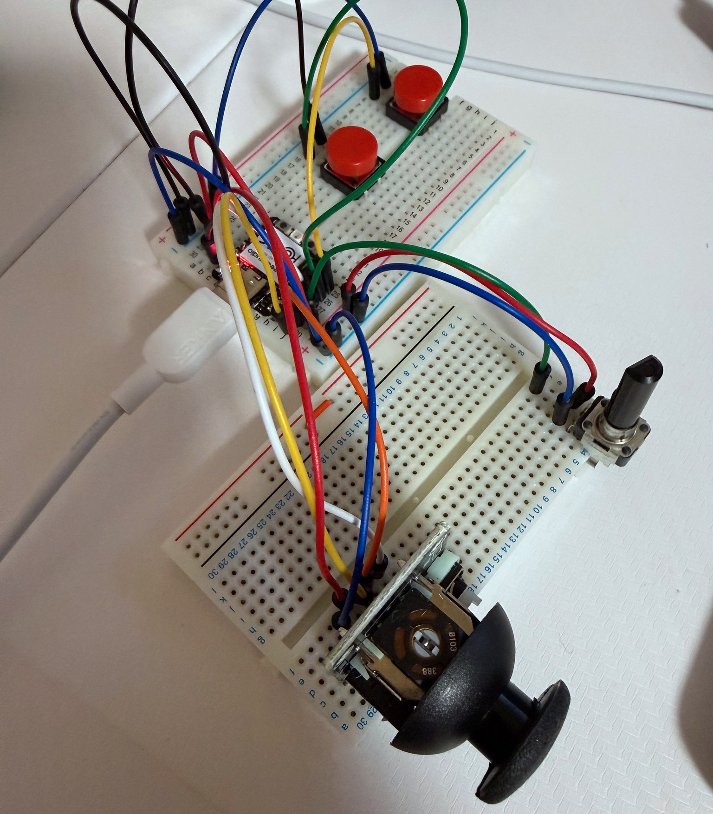

## Overview
Arduino環境向けの『Mouse Library for Arduino』を用いた自作マウスの作成を試みています。現在世界には様々な種類のマウスがありますが、新たなマウスの形を提案できるような作品を作ることができればと思います。

## Motivation
何か面白いものを作りたいと考えていたときにふと「自作キーボードの話題はよく聞くのに、自作マウスってほぼ聞かないなあ」と思いました。実際に調べてみると、自作キーボードに関するHowToの記事はかなりたくさんありましたが、自作マウスの記事はあまり多くはありませんでした。そこで『おもろい！』と感じた自分は自作マウスの作成を始めることとしました。

## Development
BBMの試作を何度も繰り返すことによって、新たなマウスの可能性を探索しています。「斬新」かつ「便利」なマウスを作りたいと考えています。

<figure>
    
    <figcaption>自作マウスのBBM作成の様子</figcaption>
</figure>

## Skill Sets
現在、作成中です。

## Outcome
現在、作成中です。
