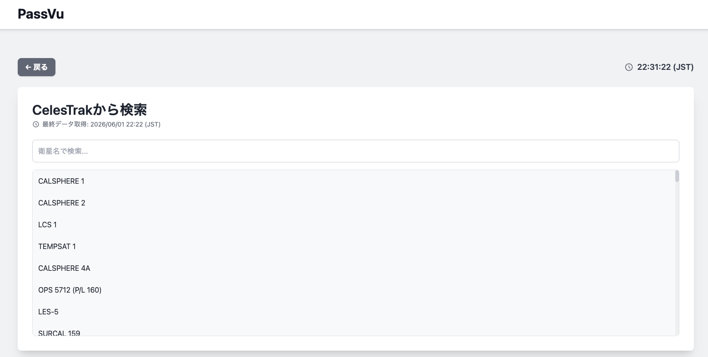
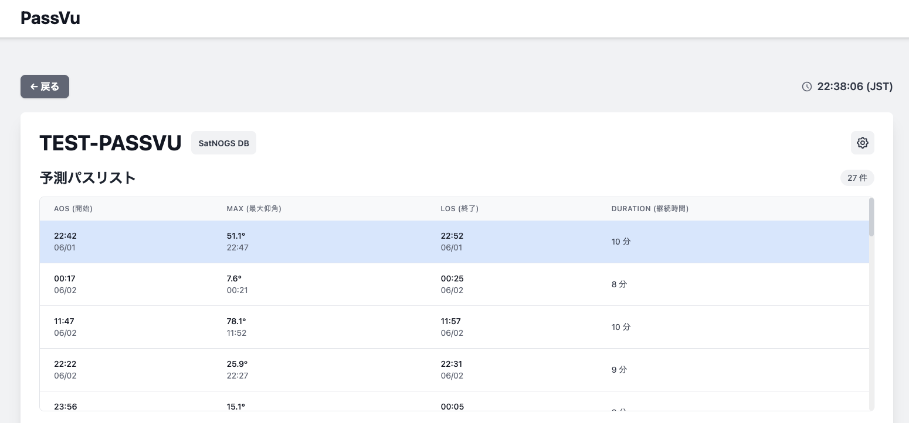
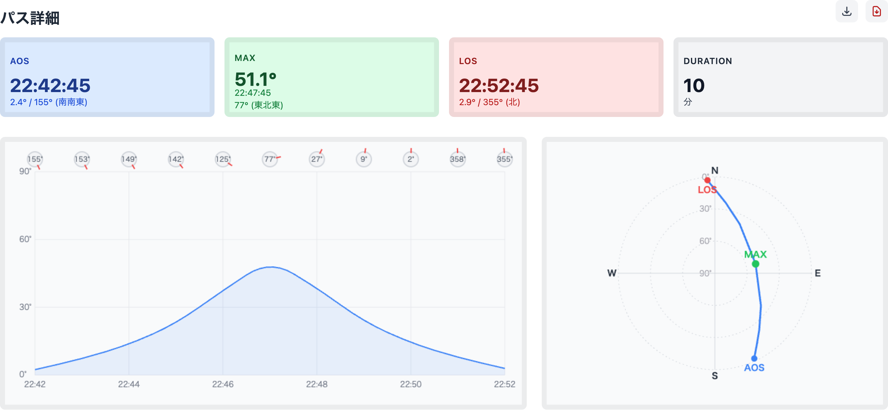
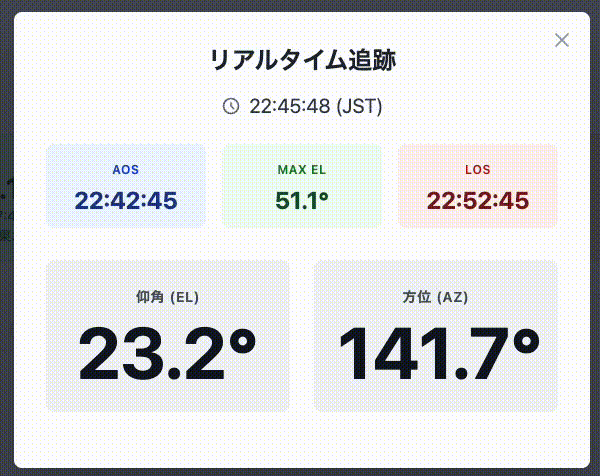

## Overview
人工衛星と通信するためには「今、その衛星がどこにいるのか」を正確に知る必要があります。衛星と地上局（地球上に存在する通信局）間で通信を成功させるには衛星が地上局から直視できる必要があります。可視状態になっている時間のことを『パス』と呼び、パスを正確に計算することが衛星通信のコツとなります。もちろんパスは地上局の場所や高度によって大きく異なるため、軌道データを用いて、適切な計算プロセスを踏む必要があります。ちなみに、人工衛星の軌道データはTLE（2行軌道要素形式）でNASAやNORADから公開されています。

## Motivation
先述の通り、人工衛星との通信のためにはパスを正確に計算する必要があります。従来よりパスの計算のためのソフトウェアは多数リリースされていましたが、以下に述べるように多くの問題がありました。
- ツールはPC専用のソフトウェアが多く、ダウンロードや設定などの手間が大きい
- 多くのツールがWindowsにしか対応していない
- ツールの使い方が難しい

現状では、こういった使い勝手の悪いツールがデファクト・スタンダードになっており、多くの初心者にとってはパスの計算が難しいものになってしまっていました。そこでこれらの問題点を改善したパス計算用のWEBツールを作りたいと考えるようになりました。

『さあ、衛星からの声を聞いてみよう』をスローガンに、衛星通信に詳しくない人やそもそも初めて知った人などが簡単に衛星通信にチャレンジできるようなツールにすることを意識し、開発を進めました。

## Development
WEBに関する知識が乏しいので、基本はGeminiのCanvas機能を利活用して作成しました。要件定義を行い、Geminiにベースを作成してもらい、最終的な手直しを自力で行い、リリースに至りました。

<figure>
    
    <figcaption>開発したPassVuのサムネイル</figcaption>
</figure>

また、パスの計算には衛星の軌道予測のための計算モデルであるSGP4/SDP4をJavaScriptで使用するためのライブラリである『satellite.js』を使用しました。TLEはCelesTrakから直接取得する仕様になっており、過剰アクセスを避けるために毎日の0時と12時に取得するような設計にしています。

計算結果が正しいことは
- 既存ツールとの整合性確認
- 実際に衛星通信に成功するかの確認

をもって確認しました。
## Skill Sets
- Vibe Coding
- CubeSat

## Outcome
作成したPassVuを紹介します。まず、検索機能を用いることで現在宇宙空間に存在する人工衛星の中から、自身がトラッキングしたい衛星を選択することができます。

<figure>
    
    <figcaption>PassVuの検索機能</figcaption>
</figure>

そして、人工衛星を選択後は今後のパスのリストを参照することができます。それらのうちから気になるパスを選択することでそのパスの詳細（どのように仰角・方位角が変化するかなど）を確認することができます。

<figure>
    
    <figcaption>PassVuのリストアップ機能</figcaption>
</figure>

<figure>
    
    <figcaption>PassVuからエクスポートできるパスの詳細（エクスポートされたものをそのまま提示しています）</figcaption>
</figure>

実際に選択したパスの時間になった時はリアルタイム・トラッキング機能が使用できます。これを使用すると衛星の現在の仰角・方位角がリアルタイムで表示されるため、衛星にアンテナを向けることを容易にします。（補足：衛星通信に用いられるアンテナの多くには指向性があり、十分な機能を発揮するためには衛星の方角にアンテナの向きを合わせる必要があります。）

<figure>
    
    <figcaption>PassVuのリアルタイム・トラッキング機能</figcaption>
</figure>

PassVuや衛星通信に興味をお持ちいただいた方はぜひ下記のリンクからご確認ください。


