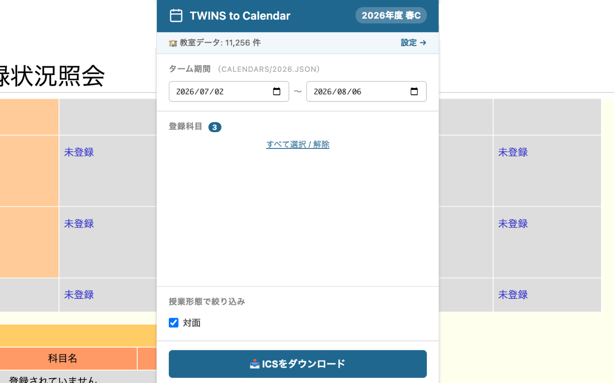

## Overview
筑波大学ではTwinsという公式の学内ツールを用いて、履修登録や履修状況の確認を行います。そこでTwinsの履修情報という一次情報をもとに、自身の時間割をGoogleカレンダー等のカレンダーアプリへ登録するためのツールを作成しました。カレンダーへの登録時は授業名や授業時間だけでなく、授業の実施場所や担当教員までが登録されるようになっており、カレンダーアプリさえ確認していれば、授業では困らないような設計にしました。

また、ツールはGoogle Chromeの拡張機能として公開しているので、学内の人であれば誰でも無料で利用することができます。

## Motivation
筑波大生の多くは、授業の時間割をTwinsやmanabaといった公式の学内ツールや時間割管理アプリなどで管理しています。しかし、これだと自身の予定を管理するカレンダーアプリと合わせて、さまざまなツールを行き来する必要が出てしまいます。また、自身の予定と授業がダブルブッキングしてしまった...というのも大学生あるあるですので、時間割もカレンダーアプリで管理できる状況を作り出したいと感じるようになりました。

様々な公開手段を考えましたが、
- 多くの筑波大生にとって、アクセス性を高めたい
- セキュリティリスクをゼロにしたい

といった理由からGoogle Chromeの拡張機能として公開することとしました。（Google Chromeの拡張機能とすることで、全学計算機でもおそらく使用できます。）

## Development
要件定義や機能定義を自身で行った上で、Claude Codeにベース部分を作成してもらいました。その上でセキュリティチェックや大学の独自形式への対応などを自身で行い、Google Web Storeに公開しました。人生で初めてGoogle Chromeの拡張機能をリリースしたので、戸惑う点も多かったですが、リリースまで楽しむことができました。

## Skill Sets
- Vibe Coding
- Chrome Extensions

## Outcome
作成した『Twins to Calendar』はChrome Web Storeにリリースしました。リリース後は自身の友人をはじめ、多くの人に使ってもらえ、実際に「便利」という声をいただきました。

<figure>
    
    <figcaption>実際に『Twins to Calendar』を使用する様子</figcaption>
</figure>

筑波大生しか恩恵を受けることはできませんが、とても便利なツールなのでぜひ使ってみてください。拡張機能は下記のリンクからダウンロードできます。

