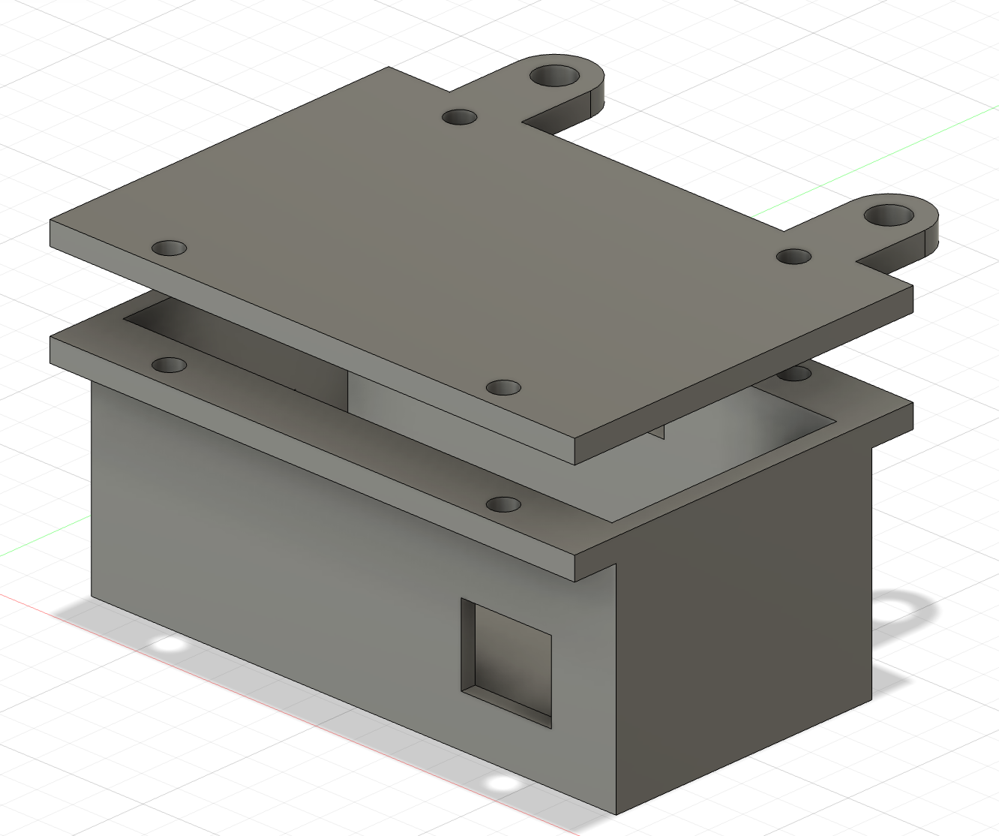
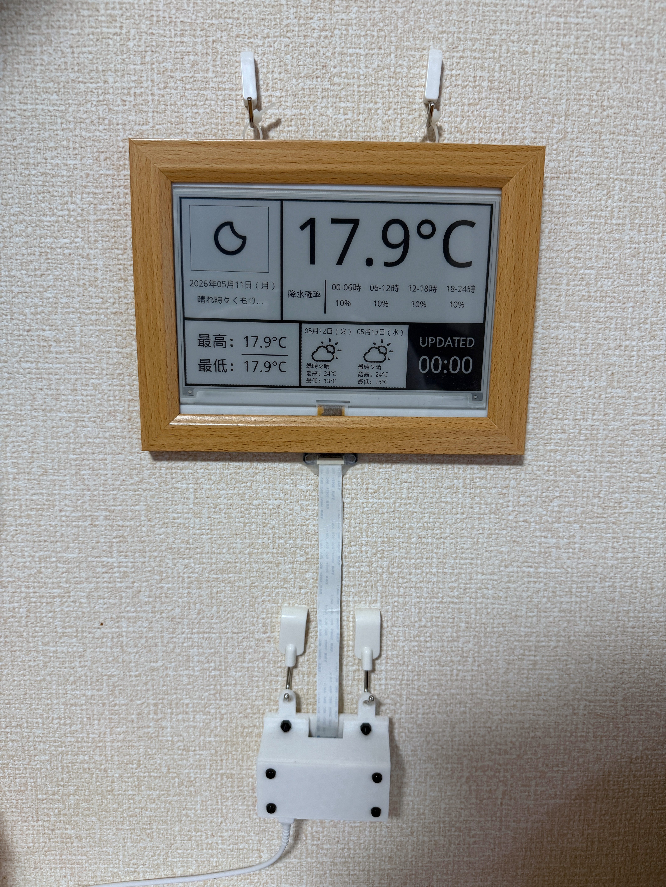

## Overview
Raspberry Piを用いて、インターネットから取得した天気の情報をもとに、電子ペーパーに天気予報や予想気温を表示するシステムを開発しました。基本的には既存のシステム（[FujiyamaYutaさんのGitHubリポジトリ](https://github.com/FujiyamaYuta/e_paper_weather_display)）をもとにし、ソフトウェア面では小さな改良を加え、ハードウェアは新しく造形をしました。

## Motivation
自身は朝が弱く、予定の直前に目が覚めるなんてことも少なくありません。その上に朝に天気予報を見るという習慣がありませんでした。それゆえに猛ダッシュで用意をして、外に出ると、大雨が降っているということも少なくありませんでした。自身は大学まで自転車で通学しているので、家を出た瞬間に降雨に気づくともう最悪です...。家の中に雨具を取りに帰らなければいけませんし、どんよりとした気分になってしまいます。

そこでぱっと見で天気がすぐに分かるようなシステムを作りたいと考え、本システムの開発に至りました。また、室内のインテリアに馴染むようなものにしたいという気持ちから、ある程度はおしゃれなものにしたいと考えました。

## Development
基本は先述のリポジトリの内容に似ているので、ソフトウェア面は省略します。

Raspberry PiのケースはAutodesk Fusionで設計し、3Dプリンタで造形しました。壁掛けできるようなケースにすることで、スタイリッシュな見た目になるように心がけました。また、電子ペーパーは100円均一ショップで購入したフォトフレームを転用することでインテリアに馴染むような木目調のデザインにしました。

<figure>
    
    <figcaption>Autodesk Fusionでケースを設計する様子</figcaption>
</figure>

## Skill Sets
- Raspberry Pi
- 電子工作
- Autodesk Fusion
- 3D Printer

## Outcome
完成した作品は以下の通りです。最新の天気予報がきちんと表示されており、先述のような最悪の事態は起こらないようになりました！！

<figure>
    
    <figcaption>全体外観</figcaption>
</figure>
